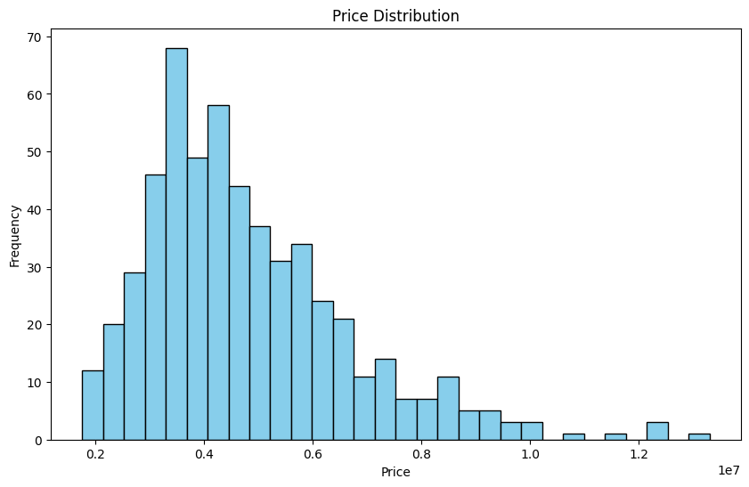
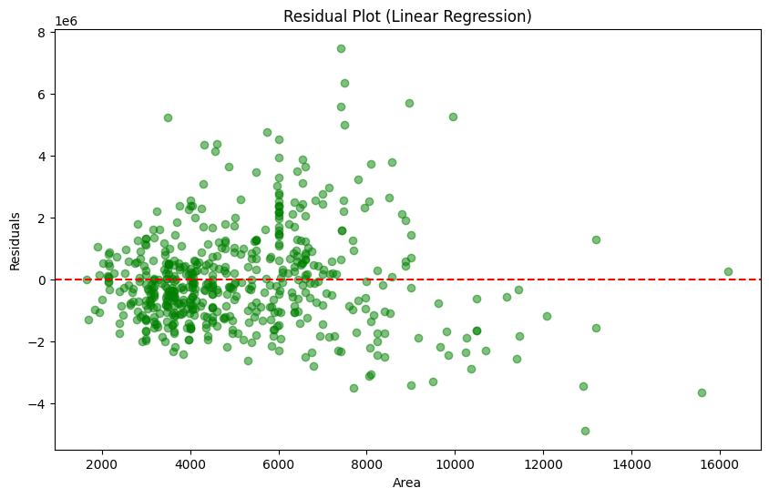

## 👤 Author
- Anthony Sergo

- GitHub: https://github.com/Tony-Magabush28
- LinkedIn: www.linkedin.com/in/anthony-sergo1 
- Email: anthonysergo9@gmail.com
- Portfolio: https://my-flask-portfolio.onrender.com/

---

## 🏡 House Pricing Dataset Project

This project analyzes and models housing prices using a dataset of house features and prices. It performs data exploration, visualization, and builds regression models (linear, polynomial, and multiple) to predict house prices.

---

## 📊 Features

✅ Data Exploration

- Mean, median, mode, standard deviation, and percentiles of house prices
- Histogram of price distribution
- Missing value checks

✅ Regression Models

- Linear Regression: Predicts price based on area
- Polynomial Regression (Degree 3): Captures non-linear relationships
- Multiple Regression: Incorporates multiple features (area, bedrooms, bathrooms,      stories, parking)

✅ Evaluation Metrics

- R² score
- Mean Absolute Error (MAE)
- Root Mean Squared Error (RMSE)
- Residual plots

✅ Feature Scaling

- Standardization using StandardScaler()

---

## 📁 Dataset
The dataset (Housing.csv) contains features such as:

- price: House price (target variable)
- area: House area in square feet
- bedrooms: Number of bedrooms
- bathrooms: Number of bathrooms
- stories: Number of floors
- parking: Parking space

---

## 🛠️ Requirements
Python 3

Libraries:

- numpy
- pandas
- matplotlib
- scikit-learn

---

## 📈 Visualizations

  
  

---

## 🚀 What I Learned

- Explored the data by calculating mean, median, mode, percentiles, and standard deviation.
- Visualized data distributions using histograms, and scatter plots. 
- Built regression models using linear, polynomial, and multiple regression techniques.
- Evaluated models using R² score, Mean Absolute Error (MAE), and Root Mean Squared Error (RMSE).

---

## 📈 Results

- R² Score (Polynomial Regression, Degree 3): 0.325
- R² Score (Multiple Regression on Training Set): 0.562
- R² Score (Multiple Regression on Test Set): 0.546
- MAE (Test Set): 1127483.35
- RMSE (Test Set): 1514173.55

---

## First 5 Rows of Scaled Features:
       area  bedrooms  bathrooms   stories   parking
0  1.046726  1.403419   1.421812  1.378217  1.517692
1  1.757010  1.403419   5.405809  2.532024  2.679409
2  2.218232  0.047278   1.421812  0.224410  1.517692
3  1.083624  1.403419   1.421812  0.224410  2.679409
4  1.046726  1.403419  -0.570187  0.224410  1.517692

---

## Means after scaling:
area        -0.000000000000000156
bedrooms    -0.000000000000000183
bathrooms   -0.000000000000000026
stories     -0.000000000000000130
parking      0.000000000000000000

---

## Standard deviations after scaling:
area         1.000919
bedrooms     1.000919
bathrooms    1.000919
stories      1.000919
parking      1.000919

---

## 📝 Price Statistics:

- Mean price: 4766729.25
- Median price: 4340000.00
- Mode price: 3500000
- Standard Deviation of price: 1870439.62

---

## 📝 Price Percentiles:
- 25th Percentile: 3430000.00
- 50th Percentile (Median): 4340000.00
- 75th Percentile: 5740000.00
- 90th Percentile: 7350000.00

---

## 📃 License

This project is provided for educational purposes and is licensed under the MIT License.

---

## 🚀 How to Run

- git clone
- cd

