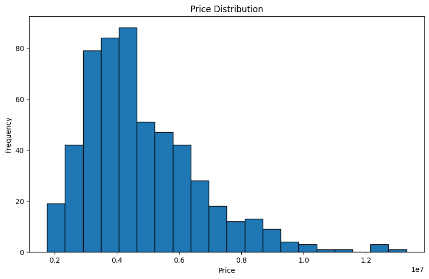
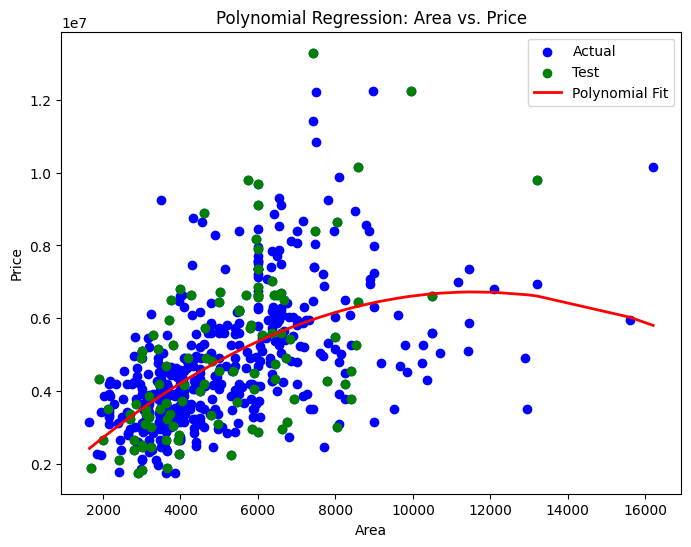
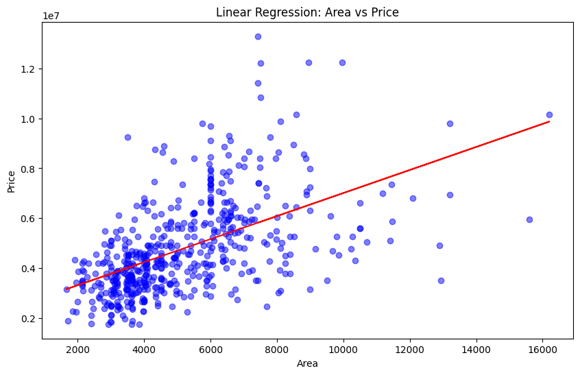

# 🏡 House Price Prediction and Analysis

This project uses Python to predict house prices using various regression techniques, including linear, polynomial, and multiple regression. It also includes exploratory data analysis (EDA), which involves measures such as the mean, median, mode, percentiles, and standard deviation.

---

## 📊 Tools Used

- Python
- Jupyter Notebook
- Pandas
- Numpy
- Matplotlib
- scikit-learn
  
---

## 📂 Project Files

- `analysis.ipynb`: The main Jupyter Notebook with code and analysis.
- `images/*.png`: Sample plot.
- `requirements.txt`: (Optional) List of dependencies.

---

## 🖼️ Sample Visualization
Here are some sample visualizations of house prices:

  
  

---

## 🚀 What I Learned
- Explored the data by calculating mean, median, mode, percentiles, and standard deviation.
- Visualized data distributions using histograms, box plots, and scatter plots. 
- Built regression models using linear, polynomial, and multiple regression techniques.
- Evaluated models using R² score, Mean Absolute Error (MAE), and Root Mean Squared Error (RMSE).

---

## 📈 Results
                                  📊 Model Performance Summary
| **Model**             | **R² Score** | **MAE (Mean Absolute Error)** | **RMSE (Root Mean Squared Error)** |
| --------------------- | -----------: | ----------------------------: | ---------------------------------: |
| Simple Linear         |         0.27 |                     1,474,748 |                          1,917,104 |
| Polynomial (Degree 2) |         0.30 |                     1,435,043 |                          1,887,327 |
| Multiple Linear       |         0.65 |                       970,043 |                          1,324,507 |

---

## 📝 Price Statistics

- Mean Price: 4,766,729.25
- Median Price: 4,340,000.00
- Mode Price: 3,500,000.00
- Standard Deviation: 1,870,439.62

## 📝 Price Percentiles:

- 25th Percentile: 3,430,000.00
- 50th Percentile: 4,340,000.00
- 75th Percentile: 5,740,000.00

---

## 🔧 How to Run
git clone https://github.com/Tony-Magabush28/House-Price-Prediction-and-Analysis

 

