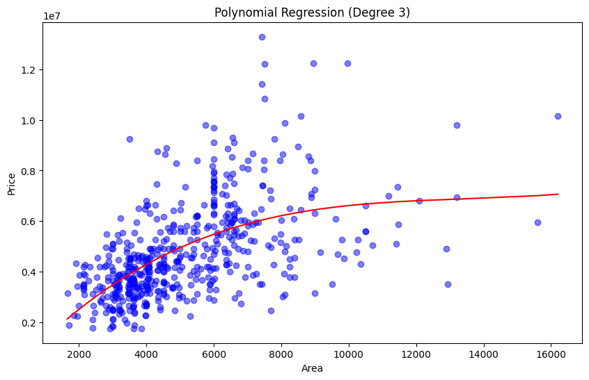

# 🏡 House Price Analysis

This project uses Python to predict house prices using different regression techniques (linear, polynomial, and multiple regression). It also includes exploratory data analysis (EDA) using measures such as mean, median, mode, percentiles, and standard deviation.

---

## 📊 Tools Used

- Python
- Jupyter Notebook
- Pandas
- Numpy
- Matplotlib
- scikit-learn

---

## 📂 Project Files

- `house_price_analysis.ipynb`: The main Jupyter Notebook with code and analysis.
- `images/house_price_distribution.png`: Sample plot.
- `requirements.txt`: (Optional) List of dependencies.

---

## 🖼️ Sample Visualization

Here’s a Sample Visualization of house prices:





---

## 🚀 What I Learned

- Data exploration using statistics and visualization.
- Building regression models using scikit-learn.
- Comparing different regression models and evaluating them using the R² score.

---

## 📈 Results

- The best model achieved an R² score of **0.78**.

---

## 🔧 How to Run

1. Clone the repository:
   ```bash
   git clone https://github.com/Tony-Magabush28/House_price_analysis
   cd house_price_analysis

